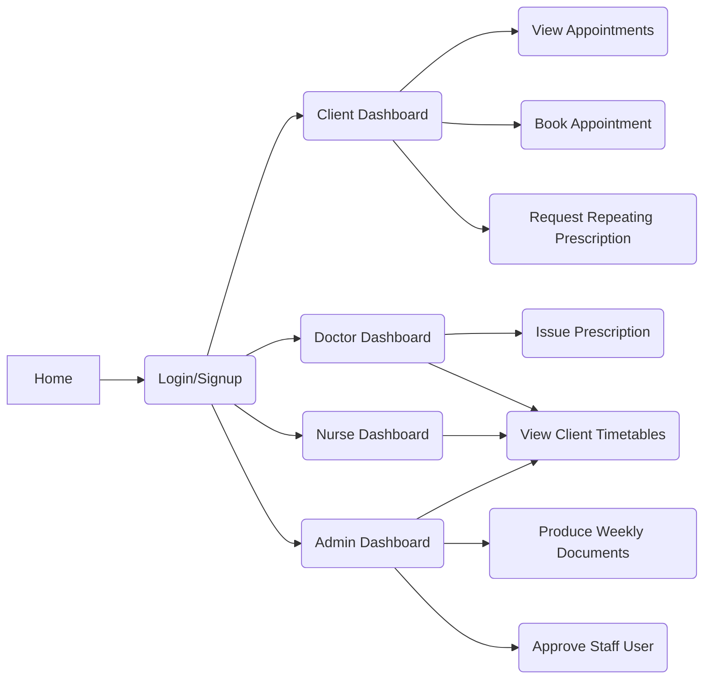

# Smart Care Prep Documents


## Table of Contents

1. [Specification Condensed](#specification-condensed)
2. [Functional Requirements](#functional-requirements)
3. [Non Functional Requirements](#non-functional-requirements)
4. [Actors](#actors)
5. [User Stories](#user-stories)
6. [Feature List](#feature-list)
7. [Navigation](#navigation)
8. [Member Preferences](#member-preferences)
9. [Links](#links)

# Preamble

### Context

> GP Business
>
> * Requires 1 doctor, 1 Nurse serve on Mon and Fri
> * 2 Rest of Week
>
> * Everybody needs online access (different authentications)
> * NHS and Private (billing records, bills to either NHS, or customer).
> * Set time consultations.
> * Prescribed or forwarded to specialist doctors

# Specification Condensed

### Project Spec

4 types of user (doctor, nurse, patient, admin)

Doc and Nurse view patient timetables, and issue prescription.

Patients book online, can request repeating prescriptions.

Invoice generation.

Admin:

> Records
>
> User operations
>
> Produce all weekly documents:
>
> 	* Turnover
> 	* Private Payments
> 	* Charges to NHS
> 	* Calc Turnovers (daily, weekly, monthly)


Session timeouts on users.

Sign-up auth by admin for nurse and doctor.
Patient is auto.

Calendar functionality through Google Calendar API as a web service.
Address lookup can be handled through google maps.

Filtering chapter 13 of HF book for showing data required to user authentication level.

# Actors

Business owner

> Are the primary client, will benefit from the system however is unlikely to personally use it.
> Therefore the main deliverable to the client will be the result that it has on the business.
> The clients in this case are Mehmet and Chris and are required to be contacted formally if we're enquiring in the role of developer and client communications.

Admin

> Oversees the management of staff accounts.
> Can view timetabling but not individual data of patients.
> Is able to generate documents required for reports within the business including charges and turnover.

Doctor/Nurse

> Fulfil the same role in terms of the system, at least within the prototype as actors.
> 

Patient

> Interacts with the system in order to meet needs to book appointments and subscriptions.
> Normal access with no higher authorisation.

DB Handler

SmartWare Company (us)

> Developing this application prototype.
> Ideally easily maintainable code that could be handed to another team after prototyping is complete or even later on down the line.

Google Calendar API

Google Maps API

# User Stories

As *x* I want to *y* so I can *z*.

## Patient

As a Patient I want to login, so I can access other functions.

## Doctor/Nurse


## Admin


# Requirements Copied From Spec

## The Web Application is expected to meet the following requirements:

1)   At least the following pages are expected to be included:

a)  The main (home) page letting users select the type of user and action ahead

b)  Login/registration page for member users is required

c)  A Dashboard page for “doctor” users 

d)  A Dashboard page for “nurse” users

e)  A Dashboard page for “patient” users

f)   A Dashboard page for “admin” users that lets to process the operations as required

2)   A user should be able to navigate through the pages, smoothly, and especially be able to access to its own dashboard and the home page from any page. 

3)   A member should remain logged on until either the session is timeout or user is changed. With this respect, access to any different member’s dashboard must be secured. 

4)   A web service can be used for acquiring Google Calendar services (or any other calendar service or API) to use for booking appointment with doctors or nurse.  Also, another web service (e.g. Google Map services) can be used to look up users’ addresses, and retrieve them automatically. 

5)   The whole system should be using 

(i)      Java EE components following MVC patterns, 

(ii)     interacting with database (Java DB), and 

(iii)     deployed on a server, which has a container (GlassFish).


# Functional Requirements

* System can only be accessed upon logging in.	
* User able to confirm user type and action ahead on homepage.
* Doctors and nurses are able to view all daily patients timetabled.
* Doctors are able to issue a perscription for a patient after a consultation or surgery.
* Patients are able to input a time, date and specified doctor to book an appointment online.
* Patients are able to request re-issue of perscription.
* Admin needs to be able to verify sign-ups for doctors and nurses.
* Create a session after upon user login


# Non Functional Requirements

* Navigation through pages should be smooth.
* There should be a shortcut back to homepage or dashboard from every page.
* Sessions should time out after 5 minutes.

# Unsure of Requirement Category
* System should produce an invoice following each surgery
* System should calculate peridoic turnovers e.g.daily, weekly, monthly.

# Feature List


## Feature X: Feature Title

Description of Feature

Inputs

Returns

Additional details


## Feature 1: Login Function

### Description

The login function is used to gain access to the application.
Also used with the session feature to create cookies which will control access to different parts of the application based on role.

### Input

* Username (textbox)
* Password (textbox)
* Submit (Button)

### Returns 

* Role of user details entered.
* Or displays message stating incorrect username/password.

### Additional Details

Will be accessed from the 'home' page.


## Feature 2: Sign-up Function

Accessed via home view

Considering the SQL supplied for the database these details will be required for signup.

```sql 
INSERT INTO CLIENTS (CNAME, CADDRESS, CTYPE, UNAME) VALUES ('Prince Hassan', 'Non-UK street, Non-UK Town, Non_UK', 'private', 'princehassan')
```

Input: Full Name, Address, Type of Care (NHS or Private), Username, Password (All textbox).


## Feature 3: Dashboards

### Description

Dashboards are the main access point for all of the features post-login.
The access will be controlled by what role you are within the system.

### Input

Role of the user that is currently logged in.
User input to whatever buttons are being displayed.

### Returns

Displays the features that are available to the user and allows access.
When user input is taken takes the user to the feature that has been requested.

### Additional Details

Requires communication from the model prior to loading the page, if attempted to access without login details, then will display a blank page.


## Feature 4: Sessions

### Description

Sessions are used to store data across page requests, as HTTP does not record any information from one page request to another. Allowing for the ability hold information/attributes between requests until user, in this case (Doctor, Patient, Nurse) has logged out.

### Input

### Returns


## Feature 5: View Client Timetables

### Description

Only accessible for Admin, Doctor, and Nurse displays the timetable of all clients for a given time period.

### Input 

* Date to View
* NHS, or Private
* Slot
* Employee
* Client

### Returns

List of client appointments that meet the criteria.

#### Additional Details

This feature will link up to the google calendar API, further details are TBD.


## Feature 6: Issue Prescription

### Description

Doctor only is able to issue prescription. 
Which will be assigned to a given client.

### Input 
* Name/Type of Prescription
* Patient 
* Issue Date
* Dosage

### Returns
Confirmation of prescription allocation.
Patient notified of prescription.

#### Additional Details


## Feature 7: Client Booking

### Description

Client is able to book an appointment with a Doctor, which will be displayed in the daily patients timetabled for doctors and nurses to view.

### Input 
* Date and Time
* Patient Information 
* Requested Doctor

### Returns
Confirmation of Successful booking.
List of available appointment slots.

#### Additional Details
This feature will link up to the google calendar API, further details are TBD.


## Feature 8: Approve Staff User

### Description

### Input 

### Returns

#### Additional Details


## Feature 9: Produce Weekly Documents

### Description

### Input 

### Returns

#### Additional Details


## Feature 10: Generate Invoice

### Description

### Input 

### Returns

#### Additional Details

# App Navigation




# Member Preferences

Preferences out of list of - Model, View, Controller, Testing, Documentation.

* Carl - 

* Dan - View, Testing, Documentation

* Frank - 

* Reece - 

* Sam - 


# Links

GitHub: [YatesyTea/esd8SmartCare: Smart care systems project for UWE 3rd year Enterprise Systems Development module. (github.com)](https://github.com/YatesyTea/esd8SmartCare)

This Document: [esd8SmartCare/prepDoc.md at main · YatesyTea/esd8SmartCare (github.com)](https://github.com/YatesyTea/esd8SmartCare/blob/main/prepDoc.md)

Trackers: [Google Sheets Tracker](https://docs.google.com/spreadsheets/d/19khCFj7zJaRq_iWB3Ul_akeA11pgPlihyJvwMop_d0c/edit?usp=sharing)

Sprint Kanban's: [Projects · YatesyTea/esd8SmartCare (github.com)](https://github.com/YatesyTea/esd8SmartCare/projects)

[Back to Top](#smart-care-prep-documents)


