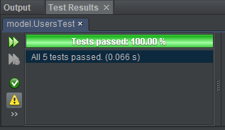

# Testing for SmartCare

[toc]

# White Box Testing (Unit Tests)

## DbConnection Test

## Users Test

Initialise with a new User as ("test", "test", "doctor") at top of testing document

| Test Name            | Testing Function | Input     | Expected Output | Actual Output |
| -------------------- | ---------------- | --------- | --------------- | ------------- |
| testGetUsername      | getUsername      | -         | test            | test          |
| testSetValidUsername | setUsername      | UName     | UName           | UName         |
| testgetPassword      | getPassword      | -         | test            | test          |
| testgetValidPassword | setPassword      | THE BIG P | THE BIG P       | THE BIG P     |
| testgetRole          | getRole          | -         | doctor          | doctor        |
| testSetValidRole     | setRole          | nurse     | nurse           | nurse         |
| testSetInvalidRole   | setRole          | asf0-98   | Error           |               |

Proof that it's passed:

## Staff Test

## Patient Test

## Booking Test

## Operation Test

## Prescription Test

[back to top](#testing-for-smartcare)

# Black Box Testing

## Feature 1: Login

Test Admin Login

Test Nurse/Doctor Login

Test Patient Login

Test Invalid Login

## Feature 2: Sign Up Function

Test Valid User Input

Test Duplicate User Input

Test Invalid User Input (Null Parameters Sent)

## Feature 3: Dashboards

Are all features here?
Do they link to correct pages?

Admin Dashboard

Nurse/Doctor Dashboard

Patient Dashboard

## Feature 4: Sessions

Go back to login page and see if you're still logged in.

## Feature 5: View Patient Timetables

Logged in as doctor/nurse user.
Click the view patient timetables button on the dashboard.

expected output : displays all of the patients timetabled appointments.

## Feature 6: Issue Prescriptions

## Feature 7: Client Booking

## Feature 8: Approve Staff User

## Feature 9: Produce Weekly Documents

## Feature 10: Generate Invoice

## Feature 11: Manage Staff

## Feature 12: Patient View Prescription

[back to top](#testing-for-smartcare)